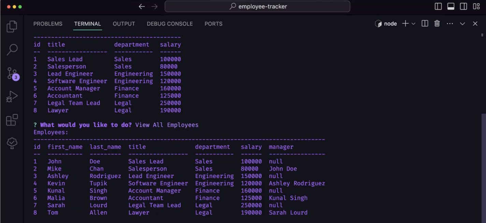

# employee-tracker
## Description

Provide a short description explaining the what, why, and how of your project. Use the following questions as a guide:

This project was created to test my skills at being able to build and deploy a database and provide the user a CLI interface. Most databases use GUI's, so the challenge of providing a project that uses a database with the CLI was intriguing to me. It reminded me of my early Air Force days using our supply database in 'green screen'. Of course that program progressed into a web based application, but this project made me think back to those old days and how much work would have gone into that program to make it work. 

I built this project to enhance my skills in both using the inquirer package as well as the mysql package.

In essence it allows a company to keep track of its employees to include their job title, salary, and manager. Right now there are three tables that include information for department, job role, and employee. This is a solid base to start from and allows for more tables if the user so requires.

As always, there are plenty of things to learn when creating a project. While I have SQL skills, I have never created a database from the command line, so I learned how to use mysql. I also learned some more npm packages, to include console.table to display the data in a nice format. I also learned about the dotenv package to create environment variables, such as a database password, to keep it secure. This was a project that I really enjoyed working on and look forward to enhancing it as time allows.

## Installation

To use the employee tracker program you must first do a couple of things.
- First, you'll want to copy this repository to your working space by using `git clone` so that you have it on you computer.
- Make sure your computer has node.js. You can check by typing in the following in your command line: `node --version`
    - If node.js is installed you will see something like what is pictured below:
    
    If you do not get a result similar to what is pictured above then you don't have node.js installed. To install it simply go to [Node.js](https://nodejs.org/en).
- Once node is installed on your computer, from your project folder, run the following commands in the command line:
    - `npm init -y` This will initialize the node package and accept the defaults.
    - `npm i inquirer@8.2.4` This will install the inquirer package/dependencies, specifically version 8.2.4.
    - `npm i mysql2` This will install the dependency needed to run sql commands.
    - `npm i console.table` This will install the dependency needed to display the database information in a nice tabular format.

## Usage

Click on the image below to see a video that shows an example of the application being used from the command line:

## Credits
Anthony Strickland contributed to this project. You can view more of his work at his [GitHub Repository](https://github.com/AnthonyStrickland?tab=repositories).

I also used the following websites to learn more about various features used in this project.

The following website was used to learn how to concatenate two columns from a table in sql:

https://www.tutorialspoint.com/concatenate-two-columns-in-mysql

The following website was used to figure out how to do a self join on a table:

https://stackoverflow.com/questions/11427300/self-join-to-get-employee-manager-name

The following website was used to learn about the console.table dependency:

https://www.npmjs.com/package/console.table

The following website was used to figure out how to split a string:

https://www.w3schools.com/jsref/jsref_split.asp

The following website was used to figure out how to use the dotenv dependency:

https://www.npmjs.com/package/dotenv

The following website was used to help with constructing sql statements:

https://www.w3schools.com/nodejs/nodejs_mysql_select.asp

